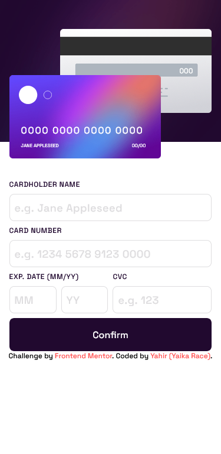
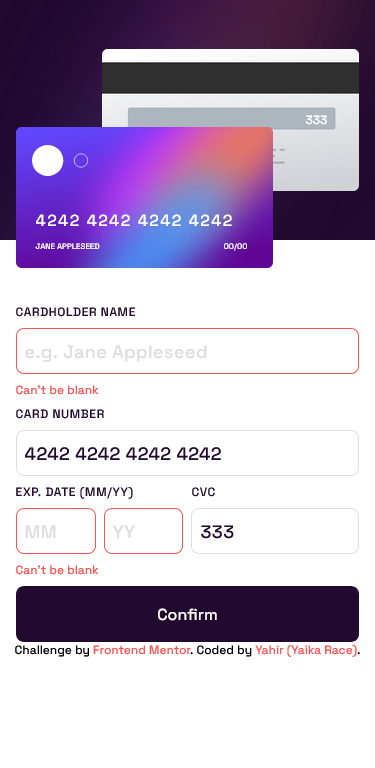
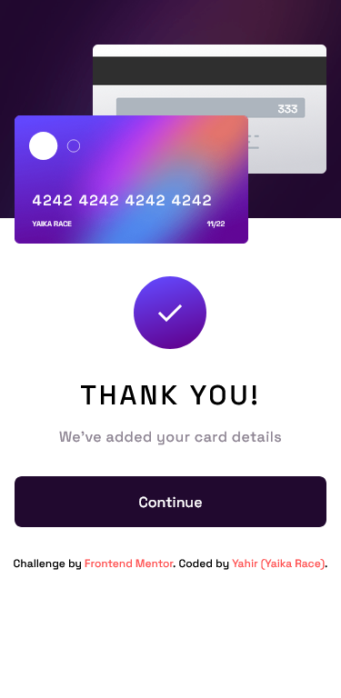

# Frontend Mentor - Interactive card details form solution

This is a solution to the [Interactive card details form challenge on Frontend Mentor](https://www.frontendmentor.io/challenges/interactive-card-details-form-XpS8cKZDWw). Frontend Mentor challenges help you improve your coding skills by building realistic projects.

## Table of contents

- [Overview](#overview)
  - [The challenge](#the-challenge)
  - [Screenshot](#screenshot)
  - [Links](#links)
- [My process](#my-process)
  - [Built with](#built-with)
  - [What I learned](#what-i-learned)
  - [Continued development](#continued-development)
- [Author](#author)

## Overview

### The challenge

Users should be able to:

- Fill in the form and see the card details update in real-time
- Receive error messages when the form is submitted if:
  - Any input field is empty
  - The card number, expiry date, or CVC fields are in the wrong format
- View the optimal layout depending on their device's screen size
- See hover, active, and focus states for interactive elements on the page

### Screenshot

#### Desktop normal view

#### Desktop active view

#### Desktop complete state

#### Mobile normal view

#### Mobile active view

#### Mobile complete state

### Links

- Live Site URL: [Click here](https://interactive-card-details-form-yaikarace.vercel.app)

## My process

### Built with

- Semantic HTML5 markup
- CSS custom properties
- Flexbox
- CSS Grid
- Mobile-first workflow
- [Tailwind CSS](https://Tailwindcss.com/) - CSS Framework
- [Vue.js](https://vuejs.org/) - JS Framework
- [Payform](https://www.npmjs.com/package/payform) - JS Library

### What I learned

I learned the basics of Vue.js and how to create components from a single file, I also learned how to integrate Tailwind CSS together with view to be able to style in a simpler way the components, I learned how to listen and emit events and how to execute methods when an event is emitted, I learned how to validate all the inputs together with a JS library (payform).

### Continued development

I will continue to learn more about Vue.js and also how to make better responsive designs with Tailwind CSS.

## Author

- Frontend Mentor - [@YaikaRace](https://www.frontendmentor.io/profile/yaikarace)
- GitHub - [YaikaRace](https://github.com/yaikarace)
- YouTube Channel - [Yaika Race](https://youtube.com/c/yaikarace)
